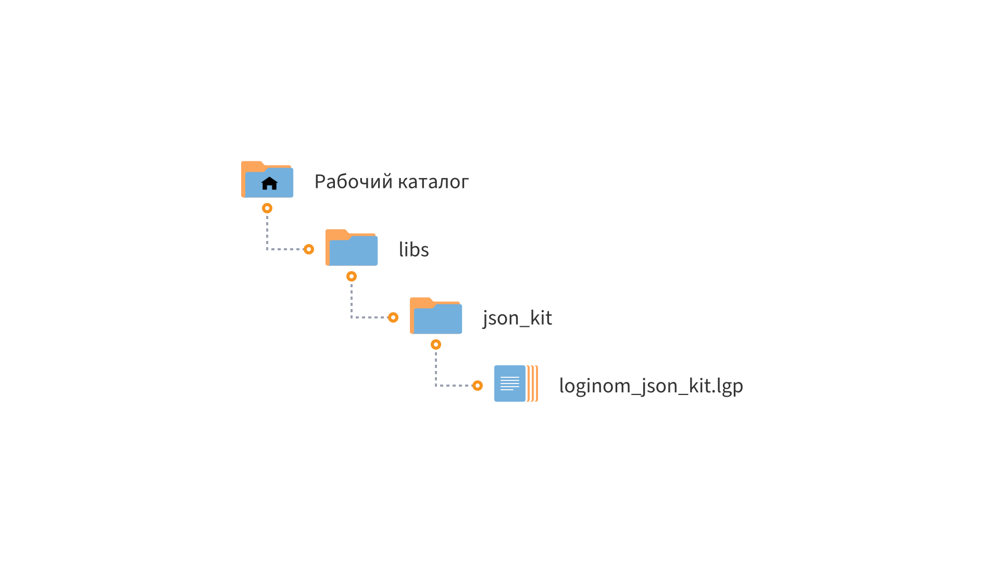

# Loginom JSON Kit

* Версия: 1.0.1
* Проверено: Все редакции Loginom 7.1.1

Набор профессиональных компонентов для работы с JSON в Loginom: 

* парсинг строк в формате JSON;
* формирование JSON-запросов из наборов данных Loginom.

Компоненты разработаны на JavaScript.

## Установка

1. Определите рабочий каталог, где будут расположены ваши библиотеки:

   * Для серверных редакций — в рабочем каталоге Loginom Server (в папке пользователя или в общей папке пользователей);
   * Для настольных редакций — в любой папке на локальном диске.

2. Создайте в нем подкаталог **libs**.

3. Разместите папку **json_kit** в каталоге **libs**.

4. Добавьте ссылку на пакет **loginom_json_kit.lgp** в своем пакете и используйте компоненты библиотеки.

## Требования

Для работы библиотеки **Loginom JSON Kit** необходимо:

* Установленное ПО Loginom. Версия не ниже 7.1.1

## Список компонентов

* [Строки в JSON](./docs/rows-to-json.md)
* [Столбцы в JSON](./docs/cols-to-json.md)
* [Добавление ключей](./docs/add-keys.md)
* [Объединение JSON](./docs/union-json.md)
* [Парсинг JSON](./docs/parsing-json.md)
* [Элементы массива JSON](./docs/array-items.md)

## Кейсы использования

Работа с библиотекой подробно рассмотрена в обучающем материале [Эффективная работа с JSON](https://skills.loginom.ru/content/1036/info/Эффективная_работа_с_JSON).

